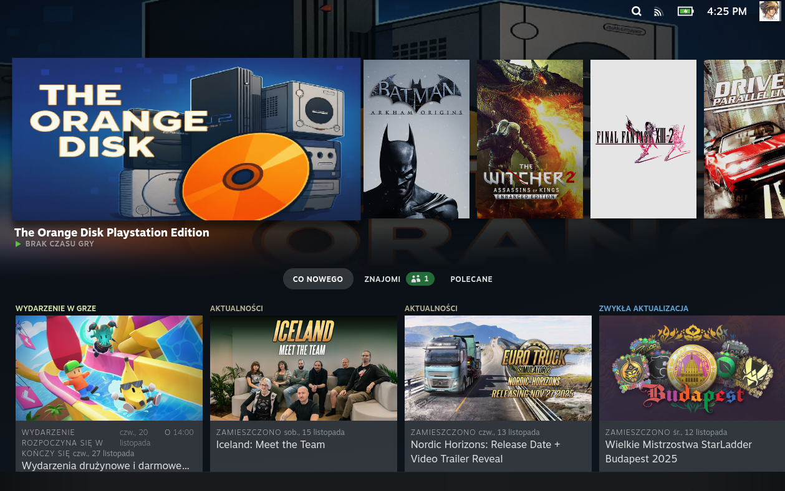
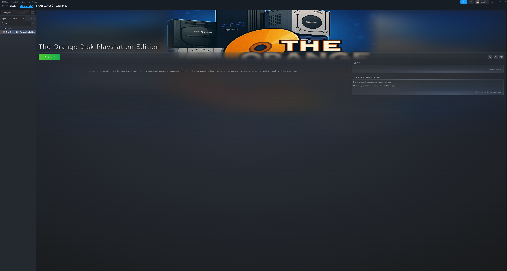

# The Orange Disk - Playstation Edition


**The Orange Disk** is a full-screen, console-like application for the Steam Deck (and other Linux-based handhelds) that allows you to manage and play your physical PlayStation 1 and PlayStation 2 game discs.

It provides a simple, controller-friendly interface to play games directly from an external USB optical drive or to create digital backups (`.iso` or `.bin/.cue`) on your device.

## Project Status

This is an early development version created by a passionate hobbyist in their free time. While fully functional for PS1 and PS2 discs, please consider it a work in progress.

Future support for other disc-based consoles may be considered if there is enough community interest and as time and resources permit. Your feedback and contributions are highly appreciated!

## Screenshots

<table>
  <tr>
    <td align="center">Main Interface</td>
    <td align="center">Big Picture Mode</td>
    <td align="center">Desktop Library</td>
  </tr>
  <tr>
    <td></td>
    <td></td>
    <td></td>
  </tr>
</table>

## Features

- **Play Directly from Disc**: Launch PS1 (DuckStation) or PS2 (PCSX2) games directly from the disc.
- **Rip Your Games**: Create 1:1 backups of your games, saving them directly into the EmuDeck folder structure.
- **Automatic Detection**: The app automatically detects the disc type (PS1 CD, PS2 CD, PS2 DVD) and required emulators.
- **Controller-First Interface**: Designed from the ground up for gamepad navigation.
- **Multi-Language Support**: Includes English and Polish translations.
- **Fully Automated Installation**: A single script handles dependencies and sets up the Steam shortcut with all artwork.

## Requirements

- **EmuDeck**: **This is a mandatory requirement.** The application is designed to work with the emulators (DuckStation, PCSX2) and folder structure provided by [EmuDeck](https://www.emudeck.com/). Ripped games are saved directly to EmuDeck's `roms` directory.
- **External USB Optical Drive**: A compatible USB CD/DVD/Blu-ray drive is required to read game discs.
- **System Tools**: The installer will automatically install required tools (`cdrdao`, `cdrkit`) if they're missing. This requires sudo/admin permissions.
- **SteamGridDB API Key** (Optional but recommended): Required for automatic game artwork download. See [SteamGridDB Setup](#steamgriddb-setup-optional) below.

### System Requirements
- **Operating System**: Steam Deck (SteamOS) or any Linux distribution
- **Python**: Python 3.x (usually pre-installed)
- **Sudo Access**: Required during installation to install disc reading tools
- **Disk Space**: ~500MB for the application + space for ripped games

## Installation (Easy Method)

1.  **Download the Installer**: Go to the [**Releases**](https://github.com/wisnia87r/The-Orange-Disk-/releases) page and download the `install-online.sh` file from the latest release.
2.  **Open a Terminal**: **Do not double-click the file.** Instead, open the application launcher and start a terminal (Konsole).
3.  **Navigate to the File's Location**: Use the `cd` command to go to the folder where you saved the file. For example:
    ```bash
    cd ~/Downloads
    ```
4.  **Run the Installer from the Terminal**: Type the following commands, pressing Enter after each one:
    ```bash
    # Make the script executable
    chmod +x install-online.sh

    # Run the online installer
    ./install-online.sh
    ```

    The online installer will:
    - Check for required tools (`curl`, `unzip`, `jq`)
    - Automatically install `jq` if missing
    - Download the latest release from GitHub
    - Extract and run the main installer
5.  **Follow the On-Screen Instructions**: The script will:
    - Check for required system tools (`cdrdao`, `cdrkit`)
    - If tools are missing, ask for your sudo password to install them
      - **On Steam Deck**: Default password is blank (just press Enter)
      - **On other systems**: Enter your user password
    - Ask if you want to configure SteamGridDB for automatic artwork (optional)
    - Set up Steam integration automatically
6.  **Launch Steam**: Start Steam. The shortcut "The Orange Disk Playstation Edition" will be in your library, fully configured.

### Why Does the Installer Need Sudo?

The installer requires sudo (administrator) permissions to:
1. **Install disc reading tools** (`cdrdao` for PS1, `cdrkit` for disc info)
2. **Load kernel modules** (SCSI generic driver for optical drive access)
3. **Set up permissions** (add your user to optical/disk groups)
4. **On Steam Deck only**: Temporarily disable read-only filesystem to install packages

**Your password is only used during installation and is not stored anywhere.**

## ❤️ Support the Project

If you find this application useful and want to support its development, you can buy me a coffee! Every donation is highly appreciated and helps motivate further improvements.

-   **[Sponsor on GitHub](https://github.com/sponsors/wisnia87r)** (Recommended)
-   **[Buy me a coffee on Ko-fi](https://ko-fi.com/your_username)** (Replace with your link)

## How to Use

- **Navigate** the menu with the D-Pad or Analog Stick.
- **Select** an option with the **Cross (A)** button.
- **Go Back** with the **Circle (B)** button.

The main menu provides the following options:
- **PLAY FROM DISC**: Launches the game currently in the drive.
- **RIP DISC**: Creates a digital backup of the game. You will be prompted to enter a name for the game. If you have configured SteamGridDB, you can select artwork for the game.
- **How to Use**: Displays a brief instruction screen.
- **About**: Shows creator information.
- **Settings**: Allows you to change the application language.
- **EXIT**: Closes the application.

## SteamGridDB Setup (Optional)

SteamGridDB integration allows The Orange Disk to automatically download high-quality artwork (covers, banners, logos, icons) for your ripped games. This makes them look professional in your Steam library.

### Getting Your API Key

1. **Create a Free Account**: Go to [SteamGridDB.com](https://www.steamgriddb.com/) and create a free account.
2. **Generate API Key**:
   - Log in to your account
   - Go to [API Preferences](https://www.steamgriddb.com/profile/preferences/api)
   - Click "Generate API Key"
   - Copy the generated key (it looks like: `1234567890abcdef1234567890abcdef`)

### Adding Your API Key

#### During Installation
The installer will ask if you want to configure SteamGridDB. If you choose yes, you'll be prompted to enter your API key.

#### After Installation
If you skipped this step during installation or want to add/change your API key later:

1. Open the configuration file:
   ```bash
   nano ~/Applications/TheOrangeDisk/the_orange_disk/config.py
   ```

2. Find this line:
   ```python
   STEAMGRIDDB_API_KEY = "YOUR_API_KEY_HERE"
   ```

3. Replace `YOUR_API_KEY_HERE` with your actual API key:
   ```python
   STEAMGRIDDB_API_KEY = "1234567890abcdef1234567890abcdef"
   ```

4. Save the file (Ctrl+O, Enter, Ctrl+X in nano)

### What Happens Without an API Key?

If you don't configure a SteamGridDB API key:
- The application will work normally for playing and ripping discs
- When ripping a game, you won't be able to select custom artwork
- Games will be added to Steam with default/no artwork
- You can always add the API key later to enable this feature

## Troubleshooting

### Artwork Not Downloading
- Make sure you have configured your SteamGridDB API key (see [SteamGridDB Setup](#steamgriddb-setup-optional))
- Check that your API key is valid by logging into [SteamGridDB](https://www.steamgriddb.com/profile/preferences/api)
- Ensure you have an internet connection

### Game Not Appearing in Steam
- Make sure Steam was closed during installation
- Try restarting Steam
- Check that the game was successfully ripped to the EmuDeck roms folder

### Disc Not Detected
- Ensure your USB optical drive is properly connected
- Try unplugging and reconnecting the drive
- Check that the disc is clean and not damaged
- The application may ask for your password to set up drive permissions

### Permission Errors
- If you get permission errors when trying to read discs:
  - The app will prompt you for your sudo password
  - This is needed to access the optical drive hardware
  - On Steam Deck, the default password is blank (just press Enter)
- After entering the password once, permissions should persist

### Installation Fails
- Make sure you have an internet connection (needed to download dependencies)
- If the online installer fails to download:
  - Check your internet connection
  - Verify the GitHub repository is accessible
  - Try downloading the full release ZIP manually from GitHub
- If sudo password prompt fails, you can install tools manually:
  ```bash
  sudo steamos-readonly disable  # Steam Deck only
  sudo pacman -S cdrdao cdrkit jq curl unzip  # Install all required tools
  sudo steamos-readonly enable   # Steam Deck only
  ```

### "jq not found" Error
- The online installer needs `jq` to parse GitHub API responses
- It will try to install it automatically
- If automatic installation fails, install manually:
  ```bash
  # Steam Deck
  sudo steamos-readonly disable
  sudo pacman -S jq
  sudo steamos-readonly enable

  # Debian/Ubuntu
  sudo apt-get install jq

  # Fedora
  sudo dnf install jq
  ```

## Contributing

This project is open-source and contributions are welcome! If you'd like to help, you can:

-   Report bugs or suggest features in the [Issues](https://github.com/wisnia87r/The-Orange-Disk-/issues) section.
-   Fork the repository and submit a pull request with your improvements.
-   Help translate the application into other languages by editing the `config.py` file.

## License

This project is licensed under the **MIT License**. See the [LICENSE](LICENSE) file for details.
